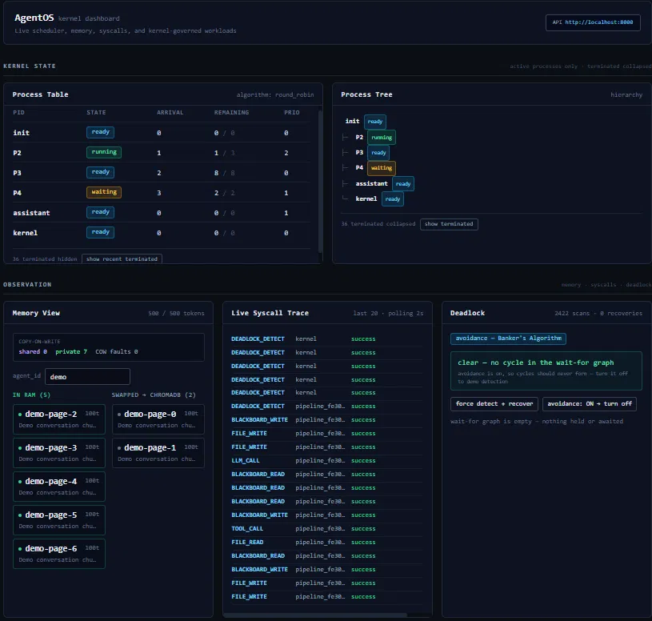
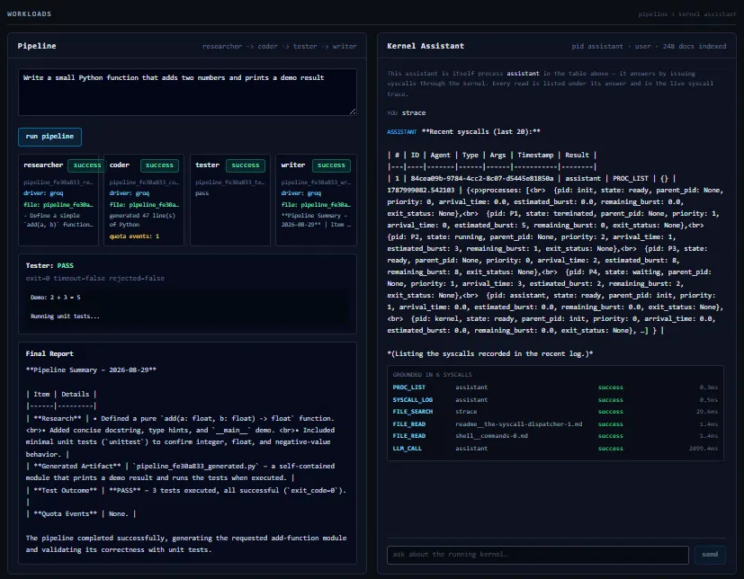
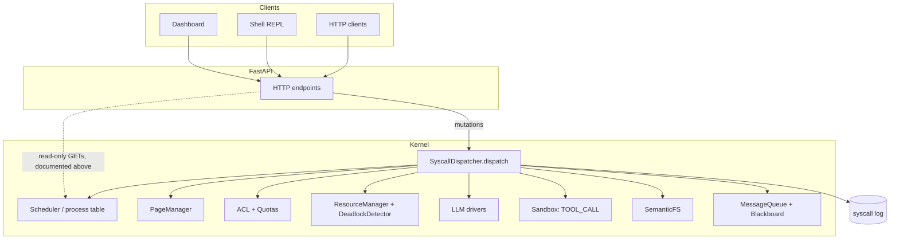

# AgentOS

**An Operating-System-Inspired Kernel for Governing LLM Agent Execution Through System Calls**

[](https://github.com/mahamudul-hasan-cse/AgentOS/actions/workflows/tests.yml)

Repository: [github.com/mahamudul-hasan-cse/AgentOS](https://github.com/mahamudul-hasan-cse/AgentOS)
Demo video: [youtu.be/_xuCx_x_UAk](https://youtu.be/_xuCx_x_UAk?si=XVaim9Wd8m7KUAhq)
Technical report: *[add PDF/link here]*



*Live kernel state: a real process tree, memory pages moving between RAM and ChromaDB swap, and every syscall logged in real time. 2,422 background deadlock scans, 8 real recoveries — Banker's Algorithm and detection both exercised live, not staged.*

---

## TL;DR

AgentOS is an Operating Systems course project where **AI agents are processes**, governed entirely through **system calls**. No agent ever calls an LLM, touches memory, or reads a file directly — every action is trapped by a single dispatcher, checked for permission and quota, logged, and only then executed for real.

- **System-call centered.** Every core agent operation — spawn, terminate, memory, files, LLM calls, IPC — is a syscall handled by one dispatcher. Nothing on the agent path bypasses it.
- **Real execution, not simulation.** Real LLM API calls, real sandboxed code execution, real memory paging to disk. The few places anything is modeled (CPU-scheduling algorithm comparison, an offline Gantt preview) are explicitly labeled as such, not hidden.
- **Optimized with real data.** Every benchmark runs two ways — seeded synthetic workloads for statistical rigor, and separately on real data captured from actual live sessions — reported separately, never mixed.
- **Honest about its own limits**, including one negative result: an original memory-eviction algorithm I designed was tested rigorously and did **not** outperform the standard baseline. That result is reported, not hidden.



*The flagship workload: four agents (researcher → coder → tester → writer) actually write and execute code end to end. The kernel assistant on the right answers questions by issuing real `PROC_LIST`/`FILE_SEARCH`/`LLM_CALL` syscalls — every answer shows exactly which calls produced it.*

---

## 1. The Problem This Addresses

Multi-agent LLM applications are usually orchestrated at the application layer — memory access, tool execution, resource limits, and agent lifecycle scattered across ad-hoc code with no single place enforcing permission, quotas, or logging consistently.

AgentOS asks whether classic OS mechanisms — processes, paging, syscalls, access control, resource allocation, deadlock handling — can **centrally govern** LLM agent execution instead, with every claim backed by a visible syscall trace rather than asserted.

---

## 2. Course Requirements — Direct Answers

| Requirement | How AgentOS addresses it |
|---|---|
| **Work must be based on system calls** | All core agent operations (spawn, terminate, wait, memory, files, IPC, LLM calls, tools, quotas, deadlock actions) go through `SyscallDispatcher.dispatch()` and its registered handlers — 21 syscall types total (§5 below). |
| **Real execution, not simulation-only** | Live LLM provider calls, real `subprocess` execution for `TOOL_CALL`, real paging with real ChromaDB swap, real ACL/quota/resource enforcement, all logged. |
| **Optimization must use real data** | `benchmarks/real_data_export.py` captures live syscall logs into `workloads/real_captured*.json`, replayed via `--workload-source real`, kept separate from synthetic results at all times. |
| **No unnecessary features** | Feature set is complete for course scope; effort since has gone into correctness, documentation, and honest evaluation rather than adding more. |

### Is it really based on system calls?

**Yes, for the agent execution path.** Every core operation traps through `dispatch()`: resolve handler → confirm the syscall is implemented before checking permission (ENOSYS-before-EPERM) → ACL check → handler executes (quota/Banker's gates run inside handlers) → status and latency logged.

**Documented exceptions**, none of them on the agent execution path:

| Exception | Why it exists |
|---|---|
| Dashboard/shell **read-only** GET endpoints | World-readable observability views, intentionally outside syscall ACL for course-demo visibility |
| `POST /resources/mode` | An operator control toggling Banker's avoidance on/off, not agent behavior |
| Startup demo-queue seeding | Bootstraps a non-empty dashboard on first load; not agent-driven |
| Pipeline dashboard status badges | Cosmetic `running`/`terminated` display between stages; the actual spawn/memory/IPC/LLM work underneath still goes through syscalls |

### Real execution or simulation?

| Genuinely real, live | Modeled / offline evaluation only |
|---|---|
| LLM provider calls (`LLM_CALL`) | Scheduling-algorithm comparison run on process traces |
| Sandboxed Python execution (`TOOL_CALL`) | `POST /scheduler/gantt` timeline preview, computed on disposable copies |
| Memory paging, eviction, ChromaDB swap | Seeded synthetic benchmark workloads |
| ACL, quotas, Banker's resource pools | |
| Syscall log and replay snapshots | |

The live system executes real work. A small, explicitly labeled part of the evaluation — comparing scheduling/paging algorithms on recorded traces — is offline analysis, the same way OS research benchmarks algorithms against workload traces rather than only live production traffic.

### Where does the real data come from?

```text
Live AgentOS session (pipeline + assistant)
        → dispatcher.log (syscall records: type, latency, timestamps)
        → benchmarks/real_data_export.py --capture
        → benchmarks/workloads/real_captured*.json
        → benchmarks/scheduler_bench.py / memory_bench.py --workload-source real
        → benchmarks/results/*_real.json
```

Real and synthetic results are never mixed in one file. **Limitation, stated plainly:** committed real captures are single sessions (n=1), not multi-seed — reported as validation evidence, not a replacement for the seeded statistical tables.

---

## 3. Architecture



Every mutation reaches the kernel through the dispatcher. The few read-only exceptions are the ones disclosed in §2.

Full syscall interface (21 types), the complete OS-concept-to-implementation mapping, and the full directory structure are in [`PROJECT_PLAN.md`](PROJECT_PLAN.md) rather than duplicated here.

---

## 4. Evaluation Highlights

Full methodology and complete tables: [`benchmarks/README.md`](benchmarks/README.md).

- **Scheduling has no universal winner.** On uniform workloads FCFS wins average wait time; MLFQ wins response time at the cost of higher wait; on heavy-tailed workloads MLFQ pulls far ahead of FCFS. Plain priority scheduling starves low-priority work — aging fixes it, at a quantified cost.
- **The honest negative result:** an original memory page-replacement policy (Semantic-LRU, evicting by embedding similarity rather than recency) was tested across 10 seeds with a random-eviction control specifically added to rule out a false win. Result: it does **not** outperform standard LRU on any tested trace, though it does reliably beat random eviction on traces with real semantic locality — proving the embeddings carry genuine signal without overstating what the algorithm achieves.
- **Real captured data confirms the synthetic direction.** A real, concurrent multi-agent session was captured from the syscall log and replayed through the same benchmarks — algorithms diverged the same way they did on synthetic data, though on a single session, reported as validation rather than statistical proof.

---

## 5. How to Run

### Docker (recommended)
```bash
docker compose up
```
Dashboard: http://localhost:3000 · API: http://localhost:8000

### Manual
```bash
git clone https://github.com/mahamudul-hasan-cse/AgentOS.git
cd AgentOS
python -m venv venv && venv\Scripts\activate      # Windows
pip install -r requirements.txt
uvicorn api.main:app --reload --port 8000
```
Second terminal:
```bash
cd dashboard && npm install
set NEXT_PUBLIC_API_BASE=http://localhost:8000
npm run dev
```
No API keys or Ollama required — the kernel falls back to a built-in offline embedder and reports which backend is active via `/health`.

### Tests and benchmarks
```bash
pip install -r requirements-dev.txt
python -m pytest tests/                                   # 151 passed
python -m benchmarks.scheduler_bench                       # synthetic
python -m benchmarks.real_data_export --capture             # capture real data
python -m benchmarks.scheduler_bench --workload-source real
```

---

## 6. Limitations

- **Identity is caller-declared, not authenticated.** Any client can claim `agent_id=root`; ACL enforces privilege against that unverified claim. Appropriate for a local course kernel, not a real security boundary.
- **CPU scheduling algorithms evaluate recorded traces**, not live concurrent LLM execution — pipeline stages run sequentially.
- **Sandboxed code execution** (`kernel/sandbox.py`) is a course-grade subprocess safeguard, not a hardened production jail.
- **Semantic embedding quality depends on Ollama** being available; without it, a hashing fallback (vocabulary-only similarity) is used automatically and disclosed via `/health`.
- **Real-data benchmark captures are single sessions**, not statistically multi-seeded.

---

## Further Documentation

- [`PROJECT_PLAN.md`](PROJECT_PLAN.md) — full syscall interface, complete OS-concept mapping, phase history, directory structure
- [`benchmarks/README.md`](benchmarks/README.md) — full benchmark methodology and result tables
- [`shell/README.md`](shell/README.md) — shell command reference

## Tech Stack

Python, FastAPI, Groq / DeepSeek / Gemini / Ollama, ChromaDB, Next.js, agno.

## Acknowledgements

Architecturally inspired by [agiresearch/AIOS](https://github.com/agiresearch/AIOS) as a reference point; independently designed and implemented.
