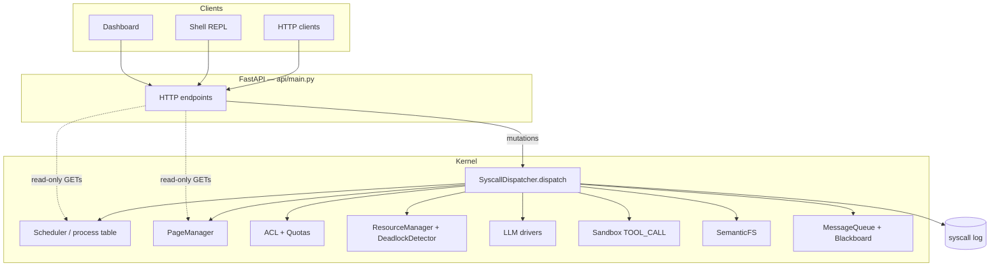

# AgentOS

**An Operating-System-Inspired Kernel for Governing LLM Agent Execution Through System Calls**

[](https://github.com/mahamudul-hasan-cse/AIOS/actions/workflows/tests.yml)

Repository: [github.com/mahamudul-hasan-cse/AIOS](https://github.com/mahamudul-hasan-cse/AIOS) 

AgentOS is a course project that applies classic operating-system ideas to multi-agent LLM workloads. Agents do not call kernel subsystems directly; they issue **system calls** trapped by `SyscallDispatcher.dispatch`, which enforces ACL, quotas, and resource gates, routes to the owning subsystem, and logs every outcome.

This is an **application-level kernel model** in Python — not a replacement for the host OS kernel.

Benchmark methods: [`benchmarks/README.md`](benchmarks/README.md) · Project blueprint: [`PROJECT_PLAN.md`](PROJECT_PLAN.md)

---

## 1. The Problem

LLM and multi-agent applications are usually orchestrated at the application layer. Memory access, tool execution, resource limits, and agent lifecycle are scattered across libraries and ad-hoc code paths. There is no single trap where privilege, quotas, and logging are enforced consistently.

AgentOS asks whether **classic OS mechanisms** — processes, paging, syscalls, access control, resource allocation, deadlock handling — can **centrally govern** those operations for LLM agents, with evidence visible in a syscall trace.

---

## 2. What Is AgentOS?

| Idea | Implementation |
|------|----------------|
| Agent as process | Each `agent_id` / PID lives in `kernel/scheduler` process table |
| Context window as RAM | `PageManager` enforces a token budget; overflow evicts to ChromaDB swap |
| Syscall trap | `SyscallDispatcher.dispatch()` — single choke point for agent work |
| Privilege | KERNEL vs USER ACL (`kernel/access_control/acl.py`) |
| Workloads | Pipeline (research→code→test→report), kernel assistant, shell, dashboard |
| Evaluation | Seeded synthetic benches **and** real captured syscall workloads |

**Core agent path:** pipeline stages, assistant chat, shell `run` / `pipeline`, and mutating HTTP routes issue syscalls. **Read-only dashboard endpoints** (`GET /scheduler/state`, `/memory/state/...`, `/syscalls/log`, etc.) read kernel state directly for observability — they are outside the agent execution path and are documented in [Limitations](#14-project-limitations).

**CPU scheduling at runtime:** live pipeline stages run **sequentially in asyncio**. FCFS, Round Robin, Priority, MLFQ, and variants are used to **evaluate recorded workloads** (benchmarks, offline Gantt) — they do **not** pick which LLM call runs next on the host.

---

## 3. Course Requirements — Direct Answers

| Course requirement | How AgentOS addresses it |
|--------------------|---------------------------|
| Work based on system calls | All core agent operations (spawn, terminate, wait, memory, files, IPC, LLM, tools, quotas, deadlock actions) go through `SyscallDispatcher.dispatch` and registered handlers |
| Real execution, not simulation-only | Live LLM drivers, real `subprocess` for `TOOL_CALL`, real paging/ChromaDB, real ACL/quota/resource enforcement and syscall logging |
| Optimization uses real data | `benchmarks/real_data_export.py` captures live syscall logs → `workloads/real_captured*.json` → `--workload-source real` bench replay |
| No unnecessary features | Feature-complete course kernel; evaluation and documentation focus on syscall path, benches, and honest limits |

### A. Is the project really based on system calls?

**Yes for the agent execution path.** Every core operation is a `SyscallType` handled inside `dispatch()` (`kernel/syscalls/dispatcher.py`):

- Trap → resolve handler → **ENOSYS-before-EPERM** → ACL → handler (quotas / Banker's gates inside handlers) → log `status` + `latency_ms`

Categories: **LLM & tools**, **memory**, **IPC & blackboard**, **filesystem**, **process lifecycle**, **quotas**, **deadlock**, **introspection** (21 types in `kernel/syscalls/types.py`).

**Documented exceptions (not on the agent hot path):**

| Exception | Why it remains |
|-----------|----------------|
| Dashboard/shell **GET** observability | World-readable kernel views without syscall ACL (course demo) |
| `POST /resources/mode` | Toggles Banker's avoidance / deadlock monitor (ops control) |
| `_seed_scheduler_demo()` at startup | Bootstrap sample queue for empty dashboard (not agent-driven) |
| Pipeline `_set_process_state()` | Dashboard **badges only** (`running`/`terminated`) between async stages; spawn/mem/IPC/LLM still use dispatch |
| `assistant.register()` idempotent re-register | Refreshes ACL if process already exists |

We do **not** claim that every HTTP handler or bootstrap helper is a syscall.

### B. Simulation or real execution?

| Real execution (live system) | Modeled / offline evaluation |
|------------------------------|------------------------------|
| LLM driver HTTP/API calls (`LLM_CALL`) | CPU scheduling algorithm comparison on process traces |
| `subprocess` Python sandbox (`TOOL_CALL`) | `POST /scheduler/gantt` timeline on throwaway `Scheduler` copies |
| Page write/read, eviction, ChromaDB swap | Seeded synthetic benchmark workloads |
| ACL, quotas, Banker's pools on `LLM_CALL` | |
| Syscall log + optional replay snapshots | |

AgentOS is a **real application** executing real workloads. Some OS algorithms are **replayed or simulated offline** to measure scheduling and paging policies — they do not schedule the host CPU or preempt live asyncio tasks.

### C. Where is the real data?

```text
Live AgentOS session (pipeline + assistant)
        ↓
dispatcher.log  (syscall records: type, args, latency_ms, timestamps)
        ↓
benchmarks/real_data_export.py  (--capture / --from-log)
        ↓
benchmarks/workloads/real_captured.json
benchmarks/workloads/real_captured_concurrent.json
        ↓
python -m benchmarks.scheduler_bench --workload-source real
python -m benchmarks.memory_bench --workload-source real
        ↓
benchmarks/results/scheduler_real*.json, memory_real.json
```

Committed captures include provenance (`syscall_count`, `capture_mode`, pipeline task outcomes). **Real and synthetic results use separate files and flags** (`--workload-source`).

**Limitations:** committed real samples are **n=1 sessions** (not multi-seed). Sequential capture may show no ready-queue contention; concurrent capture is needed for algorithm divergence. Real memory replay in the repo used a **hashing embedder** when Ollama was unavailable — see `memory_real.json` parameters.

### D. What is optimized / measured?

**Scheduling** (offline replay of workloads): FCFS, Round Robin, Priority, Priority+Aging, MLFQ, MLFQ+Boost.

Metrics: waiting time, turnaround, response time, throughput, context switches, starvation gaps (see `benchmarks/scheduler_bench.py`).

**Memory** (offline replay): FIFO, LRU, Semantic-LRU.

Metrics: page fault rate, hit ratio, retrieval accuracy on traces.

**No universal winner** — e.g. MLFQ can win response time while FCFS wins average wait on uniform bursts; priority scheduling starves without aging.

**Honest negative result:** at **n=10 seeds** with real Ollama embeddings, **Semantic-LRU did not outperform LRU** on the constructed synthetic traces (`benchmarks/README.md` §2). Semantic eviction still beats **random** on locality-bearing traces — a narrower, defensible claim.

---

## 4. System Architecture



**Agent execution flow (pipeline stage):**

```text
HTTP POST /pipeline/run
  → PipelineRunner
  → SPAWN_AGENT, SET_QUOTA  (dispatch)
  → stage work: LLM_CALL, MEM_*, FILE_*, BLACKBOARD_*, TOOL_CALL  (dispatch)
  → syscall log updated each trap
  → response: process_tree, syscalls, report
```

---

## 5. System Call Interface

Defined in `kernel/syscalls/types.py`, handled in `kernel/syscalls/dispatcher.py`.

| Syscall | Purpose | Subsystem |
|---------|---------|-----------|
| `LLM_CALL` | Generate text via provider driver | Drivers + resource pools + call-rate quota |
| `TOOL_CALL` | Run approved tool (`python_sandbox`) | Sandbox |
| `MEM_READ` | Query agent memory (page fault path) | PageManager |
| `MEM_WRITE` | Write page (eviction if over budget) | PageManager + page quota |
| `IPC_SEND` | Send async message | MessageQueue |
| `IPC_RECV` | Receive message | MessageQueue |
| `BLACKBOARD_WRITE` | Shared key/value write | Blackboard |
| `BLACKBOARD_READ` | Shared key/value read | Blackboard |
| `FILE_WRITE` | Write semantic FS file | SemanticFS |
| `FILE_READ` | Read semantic FS file | SemanticFS |
| `FILE_SEARCH` | Embedding search in FS | SemanticFS |
| `SPAWN_AGENT` | Fork child process + COW memory | Scheduler + ACL + PageManager |
| `TERMINATE_AGENT` | Kill process (optional subtree) | Scheduler + cancel in-flight LLM |
| `WAIT` | Reap zombie child | Scheduler |
| `SET_QUOTA` | Set page / call-rate limits (KERNEL) | QuotaManager |
| `DEADLOCK_DETECT` | Run wait-for cycle detection | DeadlockDetector |
| `DEADLOCK_RECOVER` | Break cycle (terminate victim) | DeadlockDetector |
| `PROC_LIST` | Process table + tree (read) | Scheduler |
| `MEM_STATE` | RAM/swap/quota view (read) | PageManager |
| `RESOURCE_STATE` | Provider pools + deadlock status (read) | ResourceManager |
| `SYSCALL_LOG` | Per-agent trace slice (read) | Dispatcher log |

---

## 6. OS Concepts Implemented

| OS concept | Implementation | Real execution / modeled |
|------------|----------------|--------------------------|
| Process management | `Scheduler`, `SPAWN_AGENT`, `TERMINATE_AGENT`, `WAIT` | Real process table; lifecycle via syscalls |
| Process hierarchy | `parent_pid`, `init`, `get_tree()` | Real |
| Process states | `waiting`, `ready`, `running`, `zombie`, `terminated` | Table is real; pipeline sets display states between stages (see §3A) |
| CPU scheduling algorithms | `kernel/scheduler/algorithms.py` | **Modeled** — bench + Gantt replay, not live LLM scheduling |
| Memory paging | `PageManager`, RAM budget, swap | **Real** on `MEM_READ`/`MEM_WRITE` |
| Page replacement | FIFO, LRU, Semantic-LRU | **Real** on eviction |
| Copy-on-write | `PageManager.fork()` on spawn | **Real** |
| Resource allocation | Per-provider slot pools | **Real** on `LLM_CALL` |
| Banker's algorithm | `ResourceManager.request()` | **Real** when avoidance enabled |
| Deadlock avoidance | Refuse unsafe grants | **Real** |
| Deadlock detection / recovery | `DeadlockDetector` | **Real** when avoidance off |
| Access control | KERNEL vs USER | **Real** in `dispatch()` |
| Resource quotas | Pages + calls/minute | **Real** |
| IPC | Message queue + blackboard | **Real** |
| File operations | Semantic FS | **Real** |
| Logging / monitoring | `dispatcher.log`, replay recorder | **Real** |

---

## 7. Real Data Pipeline

```text
Real AgentOS Session
        ↓
Syscall Execution Log  (dispatcher.log)
        ↓
benchmarks/real_data_export.py
        ↓
real_captured*.json   (format: agentos-real-workload/v1; legacy aios-real-workload/v1 also accepted)
        ↓
Scheduler / Memory Benchmark  (--workload-source real)
        ↓
Measured Results  (*_real.json, *_real.png)
```

**Captured fields include:**

- Syscall type, status, `latency_ms`, timestamps
- LLM/TOOL bursts → scheduler jobs (burst = measured seconds)
- `MEM_*` / `FILE_*` sequences for memory replay
- Provenance: `syscall_count`, `capture_mode`, driver, pipeline outcomes

**Reproduce a new capture:**

```bash
python -m benchmarks.real_data_export --capture
python -m benchmarks.real_data_export --capture --concurrent
```

**Replay committed workloads:**

```bash
python -m benchmarks.scheduler_bench --workload-source real --workload benchmarks/workloads/real_captured_concurrent.json
python -m benchmarks.memory_bench --workload-source real
```

Synthetic and real paths are **never mixed** in one results file.

---

## 8. Benchmarks and Results

Full methodology: [`benchmarks/README.md`](benchmarks/README.md). Artifacts: `benchmarks/results/`.

### Scheduling (synthetic, seed=20260726)

From `benchmarks/results/scheduler.json` (uniform profile, 24 processes):

| Algorithm | Avg wait | Avg response |
|-----------|----------|--------------|
| FCFS | 55.4 | 55.4 |
| Round Robin | 87.5 | 36.2 |
| MLFQ | 101.4 | 27.5 |

**Findings:** On homogeneous bursts, **FCFS can win average waiting time**; **MLFQ improves response time** at the cost of higher wait. Round Robin improves responsiveness vs FCFS but increases average wait. Priority scheduling can starve low-priority work; **aging mitigates** starvation (see `scheduler_starvation_*.png`). These are **offline** measurements on constructed workloads.

### Scheduling (real concurrent capture, n=1)

From `benchmarks/results/scheduler_real_concurrent.json` (20 jobs, overlapping syscalls):

| Algorithm | Avg wait | Avg response |
|-----------|----------|--------------|
| FCFS | 179.9 | 179.9 |
| Round Robin | 242.4 | 33.6 |
| MLFQ | 202.6 | 5.2 |

**Finding:** When the captured session has **ready-queue contention**, algorithms **diverge** — validation only (n=1), not a substitute for seeded tables.

### Memory (synthetic)

Policies: **FIFO**, **LRU**, **Semantic-LRU** (plus random as bench control).

**Rigorous result (n=10 seeds, real embeddings):** documented in `benchmarks/README.md` §2 — **Semantic-LRU did not beat LRU** on any constructed trace at n=10. Embeddings are not inert: Semantic-LRU beats **random** on locality-bearing traces (e.g. clustered).

Committed `benchmarks/results/memory.json` in this repo was produced with **`num_seeds: 2`** (faster run); use `--seeds 10` locally for the full statistical sweep.

### Memory (real capture, n=1)

From `benchmarks/results/memory_real.json` (hashing embedder): FIFO/LRU fault rate **0.9565**; Semantic-LRU **0.9130**; Random **0.8261**. Directionally consistent with synthetic work but **not** a robust confirmation (single session, non-semantic embeddings).

---

## 9. Real vs Synthetic Evidence

| Evidence | Purpose | Strength | Limitation |
|----------|---------|----------|------------|
| **Synthetic** (`--workload-source synthetic`) | Statistical comparison, sweeps, Belady, starvation curves | Repeatable seeds; multi-profile; citable parameters | Constructed workloads, not a single live session |
| **Real captured** (`--workload-source real`) | Validate integration with live syscall latencies and access order | Produced by actual AgentOS execution | Typically **n=1**; may lack contention unless concurrent capture |

Quote seeded tables for strong claims; quote real captures as **practice validation** and state sample size.

---

## 10. Project Structure

```text
AgentOS/
├── api/                 # FastAPI entry (main.py)
├── kernel/
│   ├── syscalls/        # Dispatcher, syscall types
│   ├── scheduler/       # Process table + CPU algorithms
│   ├── memory/          # Paging, replacement, embeddings
│   ├── access_control/  # ACL, quotas, Banker's, deadlock
│   ├── drivers/         # Groq, DeepSeek, Gemini, Ollama
│   ├── filesystem/      # Semantic FS
│   ├── ipc/             # Queue + blackboard
│   ├── replay/          # State recorder
│   └── sandbox.py       # TOOL_CALL execution
├── agents/              # Pipeline, kernel assistant
├── shell/               # CLI REPL over HTTP
├── dashboard/           # Next.js UI
├── benchmarks/          # Benches, real export, workloads, results
├── tests/               # pytest suite
├── docs/                # Optional static project page
└── README.md            # Course project page (primary)
```

---

## 11. Technology Stack

| Layer | Technology |
|-------|------------|
| Kernel API | Python 3.10+, FastAPI, uvicorn, asyncio, Pydantic |
| Vector / swap storage | ChromaDB |
| Embeddings | Ollama (`nomic-embed-text`) with hashing fallback |
| LLM providers | Groq, DeepSeek, Gemini, Ollama (configurable) |
| Agent identity | [agno](https://github.com/agno-agi/agno) (example agents) |
| Dashboard | Next.js, TypeScript, Tailwind |
| Testing | pytest |
| Deployment | Docker Compose (optional) |

---

## 12. Testing

```text
151 passed
0 failed
```

(Verified after latest changes — run `python -m pytest tests/` to reproduce.)

| Area | Test module |
|------|-------------|
| Syscall routing | `test_syscalls.py` |
| ACL | `test_access_control.py` |
| Quotas | `test_quotas.py` |
| Memory / paging | `test_memory.py` |
| Copy-on-write | `test_cow.py` |
| Scheduler algorithms | `test_scheduler.py`, `test_starvation.py` |
| Process hierarchy | `test_process_tree.py` |
| Termination / cancel LLM | `test_termination.py` |
| Deadlock | `test_deadlock.py` |
| IPC | `test_ipc.py` |
| Filesystem | `test_filesystem.py` |
| Pipeline | `test_pipeline.py` |
| Kernel assistant | `test_assistant.py` |
| HTTP API | `test_api_http.py` |
| Shell | `test_shell.py` |
| Embeddings | `test_embeddings.py` |
| Replay | `test_replay.py` |
| Real workload loading | `test_real_data_bench.py` |

CI runs on push/PR without API keys or Ollama (`.github/workflows/tests.yml`).

---

## 13. How to Run

### Option 1 — Manual

```bash
git clone https://github.com/mahamudul-hasan-cse/AIOS.git AgentOS
cd AgentOS
python -m venv venv
venv\Scripts\activate          # Windows
# source venv/bin/activate     # macOS/Linux
pip install -r requirements.txt

uvicorn api.main:app --reload --port 8000
```

Second terminal (dashboard):

```bash
cd dashboard
npm install
set NEXT_PUBLIC_API_BASE=http://localhost:8000    # Windows cmd
# export NEXT_PUBLIC_API_BASE=http://localhost:8000  # macOS/Linux
npm run dev
```

Open http://localhost:3000. If port **8000** is blocked (common on Windows/Hyper-V), use **8010** and set `NEXT_PUBLIC_API_BASE` accordingly.

Optional: copy `kernel/config.yaml.example` → `kernel/config.yaml` for provider keys (never commit `config.yaml`).

### Option 2 — Docker

```bash
docker compose up
```

Dashboard: http://localhost:3000 · API: http://localhost:8000

```bash
AGENTOS_API_PORT=8010 AGENTOS_DASHBOARD_PORT=3001 docker compose up   # custom ports
```

### Benchmarks

```bash
python -m benchmarks.scheduler_bench
python -m benchmarks.memory_bench --seeds 10    # long; use --seeds 2 for quick check
python -m benchmarks.real_data_export --capture
python -m benchmarks.scheduler_bench --workload-source real --workload benchmarks/workloads/real_captured_concurrent.json
```

### Tests

```bash
pip install -r requirements-dev.txt
python -m pytest tests/
```

---

## 14. Project Limitations

- **Identity:** `agent_id` is caller-declared, not authenticated — suitable for a local course demo, not multi-tenant security.
- **CPU scheduling:** Algorithms evaluate **recorded** workload traces; they do **not** schedule live concurrent LLM execution (asyncio stages are sequential).
- **Observability bypass:** Dashboard GET endpoints read kernel state without syscall ACL — intentional for visibility.
- **Bootstrap demo:** Startup may seed a sample scheduler queue (`_seed_scheduler_demo`) unrelated to agent syscalls.
- **Real data sample size:** Committed captures are single sessions (n=1); concurrent capture needed for scheduling divergence.
- **Embeddings:** Semantic paging/FS quality depends on Ollama; hashing fallback is vocabulary-only.
- **Sandbox:** `TOOL_CALL` uses course-grade subprocess isolation — not a hardened production jail.
- **Gemini driver:** Uses deprecated `google.generativeai` package (warning in tests).

---

## 15. Academic Contribution

- Maps **OS principles** (processes, paging, syscalls, ACL, Banker's, deadlock) onto **modern LLM agent systems**.
- Uses a **syscall dispatcher** as the central governance mechanism for agent work.
- Executes **real workloads** (LLM calls, sandbox, paging) — not only static algorithm demos.
- Captures **live execution** for benchmark replay, separate from synthetic evidence.
- Reports **negative experimental results** (Semantic-LRU vs LRU) honestly.
- States **architectural boundaries** (real execution vs offline evaluation, observability vs agent path) explicitly.

---

## Security & Identity Model

Agent identity is **caller-declared**. Any client can claim `agent_id=root`. ACL enforces privilege **given that claim** — it is not authentication. See limitations above.

Generated code runs via `TOOL_CALL` / `python_sandbox` (`kernel/sandbox.py`) — AST deny-list, timeout, scratch directory; not hostile-code safe.

---

## References

- [`benchmarks/README.md`](benchmarks/README.md) — benchmark design and results
- [`PROJECT_PLAN.md`](PROJECT_PLAN.md) — phase history and architecture blueprint
